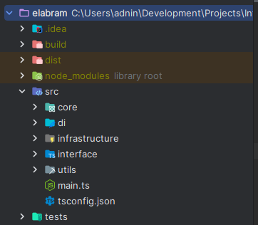

# Elebram Backend

### Disclaimer

> This is a project created for the purposes of a test case from the hiring process at [Elabram.com](https://elabram.com)

## Design Architecture

This project uses hexagonal architecture. Hexagonal architecture is another form of applying the clean architecture principle.
Basically, hexagonal architecture uses the basic principles of clean architecture. For further explanation
regarding this, you can go to the following article [hexagonal](https://herbertograca.com/2017/11/16/explicit-architecture-01-ddd-hexagonal-onion-clean-cqrs-how-i-put-it-all-together/)

In this project there are 3 parts, namely the core, port and adapter. The port is a collection of interfaces that
will later connect the core part of the code (business logic) with the implementation of the port, namely the adapter.
The adapter itself usually consists of an external implementation of the code that does not affect the code at all,
examples include repository, apicall and redis.

- **app** package contains cmd and deps. cmd contains commands to run the server and scheduler while deps contains initialize the required dependencies.
- **config** package contains initialization configuration
- **core** package contains ports and use cases
- **docs** package contains api documentation via swagger
- **infrastructure** package contains implementations of ports called adapters
- **interface**  package contains the initialization of the API route
- **pkg** package contains helpers and utilities

## Getting Started

- The system must be ensured to have MySQL & yarn
- Install dependencies `yarn install`
- Copy `.env.example` to `.env`
- Configure `.env` configurations with your own config
- Run migrations `yarn knex:migrate:latest`
- Run seeders `yarn knex:seed:run`
- Open new terminal `yarn build:dev` (build ts to js)
- Open new terminal `yarn start:dev` (run compiled js)
- Open http.rest (install http rest extension in vscode or use postmant, etc)
- Run signup endpoint

## Stacks

- Node.js v20.11.0
- Express.js
- MySQL
- JWT
